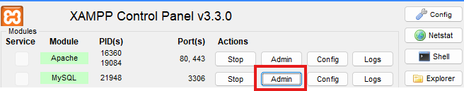
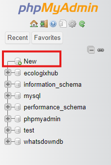
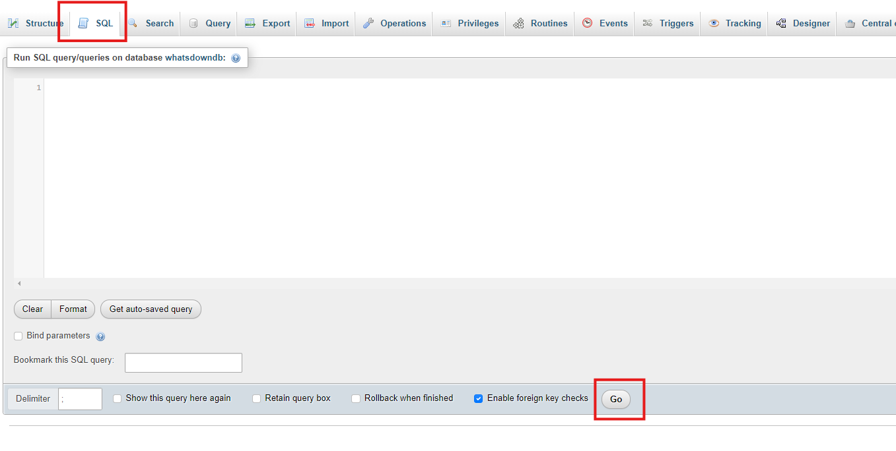

# Ecologixhub-Database Project

This web application acts as an interface created specifically for administrating a database related to a platform 
in which solutions for different environmental problems are discussed. This app was created having in mind that you must 
be able to navigate from one entry of the database to any other entry uninterrupted by accessing entries (nodes) related 
to the one currently displayed as long as all the necessary relations exist in the database too.

## Technical Details

This app makes use of the Angular framework for the front-end, PHP for the back-end and a MySQL database. I've used XAMPP to run the server locally 
with a MySQL database. The Angular app employes multiple services for sending requests to the php scripts or saving data when navigating from one 
entry to another for different purposes.

## Setting it Up

### 1. Installing XAMPP

Check the official [page](https://www.apachefriends.org/) for the right version for you.

### 2. Cloning this Repository

First you have to go into the terminal, move to the directory of the xampp app and then go into htdocs by running:

```powershell
cd xampp/htdocs

git clone https://github.com/mmswflow-upb/EcoLogixHub-DB-Project.git
```

### 3. Running the Server

Run the xampp app, then click on the start buttons adjacent to "Apache" & "MySQL", the web application should be running now.

### 4. Entering the Database Admin Page

Click on the "admin" button next to "MySQL", you will be directed to a PHPMyAdmin page. 



### 5. Creating the Database for the App

On the left, you have a button "new", click it and you will be directed to a page where you can set up a new DB, give it the name "whatsdowndb".



### 6. Creating the Users Table

On the left, the whatsdowndb database will appear, click it then go to the "SQL" section, copy the commands from the [sql script](db_creation_script.sql) then paste it into the text box and click go.



### 7. Installing Node.js & NPM

Check the official [website](https://nodejs.org/) and download nodejs along with npm, then verify the installation with the following commands, the versions should be displayed:

```powershell
node -v
npm -v
```

### 8. Installing the Angular CLI

Run the following command to install the Angular command line interface (CLI), then verify installation by checking the version: 

```powershell
npm install -g @angular/cli
ng version
```

### 9. 
